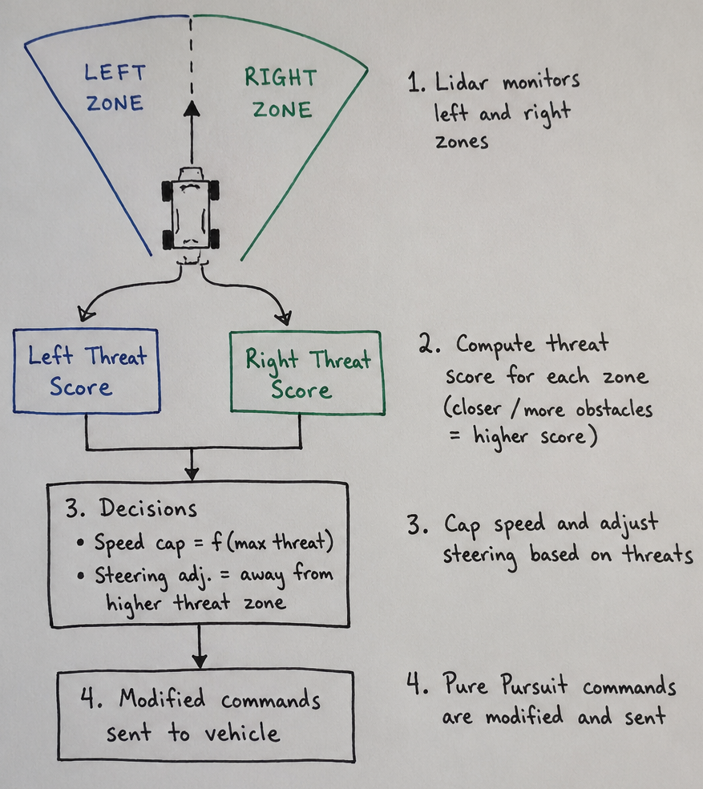

# RoboRacer Final Race — Dynamic Pure Pursuit Racing Stack

A ROS 2 autonomous racing stack for the RoboRacer (F1TENTH) platform: manually engineered racelines interpolated onto a spline, curvature-based target-speed planning, Pure Pursuit with a speed- and curvature-dependent lookahead, a controller-armed launch boost, and a reactive LiDAR zone-monitoring layer that caps speed and nudges steering around obstacles.

## Demo Video

[](https://youtu.be/eFsYxvazVSA)

*Click the image above to view the race performance video.*

---
## Racing Strategy

Our primary strategy focused on robust path tracking using a dynamic Pure Pursuit implementation. We wanted to keep our implimentation simple and easily tunable.

1.  **Waypoint Engineering:** Rather than using raw centerlines, we generated waypoints manually using a custom waypoint generation script. This let us craft our race line by manually clicking waypoints designed for high-speed cornering.
2.  **Dynamic Lookahead:** The `pure_pursuit_node` does not use a fixed lookahead distance. Instead, the lookahead distance is dynamically calculated as a function of the vehicle’s current speed and the curvature of the track ahead. As speed increases, the car looks further ahead to maintain stability. If the track ahead has high curvature the lookahead dynamically shrinks to closely follow the raceline and reduce corner cutting.
3.  **Physics based Target Speed:** Target speeds were pre-calculated for the entire track based on the local curvature of the generated waypoints. High-curvature sections (tight turns) have lower target speeds, while low-curvature sections (straights) allow for maximum velocity. We also used tunable parameters for lateral and longitudinal acceleration to calculate how fast we could take turns, how quickly we could ramp up speed on the straights, and most importantly, how late we could wait before breaking for turns.
4.  **Launch Boost:** To capitalize on the open straight at the start, the `pure_pursuit_node` exposes a controller-armed launch boost. Pressing Square on the joystick arms the boost and R1 fires it, after which the waypoint target speed is multiplied by a tunable `boost_scale` for `boost_duration` seconds with steering forced straight, then ramped back into normal Pure Pursuit control. This was decisive in getting us out front at the start of the race, where the path is known to be clear so the obstacle-avoidance speed cap is safely bypassed.

Currently, our controller’s performance is limited by the precision and latency of the particle filter localization. In future iterations, exploring other localization methods could significantly improve high-speed tracking performance. There are also many tweaks to our approach that if implemented could improve our performance. Some examples are seperate params for accelerating and braking, lidar filtering, or monitoring how fast obstacle are approaching for obstacle avoidance.

---

### Node Descriptions

Our racing stack consists of the following custom nodes:

* **`waypoint_gen_node`**: This tool is used offline to generate the base trajectory waypoints on the target race map. With the partical filter publishing the map to foxglove, you can click on points using the initialpose tool in foxglove and each waypoint is added to a csv file.
* **`pure_pursuit_node`**: As the core controller, this node subscribes to localization data (currently the provided particle filter) and waypoints. It interpolates the base waypoints to generate a new list of waypoints along a spline. It also calculates localized curvature, target speed, and dynamic lookahead distance for each waypoint and can recalculate all values when parameters are changed. Standard Pure Pursuit geometric methods are applied to generate speed and steering commands (`ackermann_drive_stamped`) with adjustments added from our obstacle avoidance node.
* **`obs_avoidance_node`**: This node implements our reactive obstacle avoidance method. It creates two sensing zones directly in front of the car and monitors Lidar scans for intrusions (see details below). It modifies the incoming command from `pure_pursuit_node` to cap speed and adjust steering to maintain safety.
* **`debug_node`**: A utility node used to monitor controller performance. It visualizes the computed raceline and the location of the active target lookahead waypoint in Foxglove.
* **`sensor_filtering_node`** (In Development): This node was designed to clean sensor noise (Lidar and Odom) and improve the performance of the `obs_avoidance_node`. Due to time constraints, it was not fully tested and integrated into the final race code.

---

## Obstacle Avoidance Approach

We utilize a simple, yet effective, **Reactive Zone Monitoring** method for obstacle avoidance. This system acts as a "safety filter" over the primary Pure Pursuit controller, dynamically modifying the output drive command based on real-time Lidar data.


*Figure 1: Visualizing the reactive obstacle avoidance logic.*

### How it Works

The Lidar scan monitors two distinct "sensing zones" to the left and right of the vehicle’s immediate path. If obstacles enter either zone, the code calculates the distance of detections and generates a threat score for each zone. See Figure 1 for a visualization of our obstacle avoidance layer

* **Wall Mitigation:** To avoid false positives (e.g., reacting to racetrack walls during sharp turns), detections on the far periphery (sides) of the car are weighted significantly lower than those directly in front. This ensures the reactive logic prioritizes obstacles blocking the primary travel path.
* **Speed Capping:**  Using the max threat score between the two zones we cap the maximum permissible speed of the car, superseding the target speed provided by the Pure Pursuit node. This ensures the car slows down when obstructed.
* **Steering Adjustment:** We also look at which zone has a higher threat score and calculate a steering adjustment to move the car away from the denser/closer obstacle field. This adjustment is added to the steering command generated by the Pure Pursuit controller.

---

## Challenges and Solutions

We faced a few difficulties while tuning our pure pursuit code. The issue was that we noticed that our car was turning too early or would spin out on the turns. We eventually realized this was a bug with our pure pursuit code, where we had assigned the car the velocity of the next waypoint instead of the current waypoint.
Additionally, during tuning we faced difficulties finding the balance between driving fast on the straights, but still being able to make the sharp u-turns. We used Foxglove panels with ROS parameters to be able to dynamically tune our code.

We faced challenges with integrating obstacle avoidance with our pure pursuit code. We first attempted obstacle avoidance with a follow the gap type algorithm that would get activated when an obstacle was detected. However, this approach led to a lot of false positives and affected the performance of our pure pursuit controller. We then switched to the zone monitoring approach, which had better results. We still struggled to make the obstacle avoidance work at high speeds, as the car often had too much momentum to detect or avoid the obstacle. We ended up needing to slightly lower our pure pursuit speed to allow the obstacle avoidance to work.

---

## Results and Future Work

Our architecture achieved reliable performance in Race 3. The Pure Pursuit implementation allows for consistent raceline tracking and the reactive obstacle avoidance system successfully detected and navigated around obstacles without impacting basic racing performance in clear sections.

### Future Improvements

If given more time, we would focus on the following upgrades:

1.  **Robust Sensor Filtering:** Fully test and integrate the `sensor_filtering_node` to reduce raw data jitter, leading to smoother velocity profiles from the obstacle avoidance layer.
2.  **Advanced Obstacle Avoidance:** Replace the current reactive method with a dynamic local planner that can plan paths around obstacles rather than just steering away from them.
3.  **Localization Upgrade:** Implement better localization to replace the basic particle filter, providing more reliable high-frequency state estimates required for higher maximum speeds.

---

## How to Build and Run

### Dependencies

* ROS 2 Humble
* RoboRacer Simulator or hardware interface

### Build Instructions
1. Clone this repository
    ```bash
    git clone https://github.com/li51-AMX/RoboRacer_Final_Race.git final_race
    ```
2.  Navigate to your workspace (`colcon_ws`) and clone the pure_pursuit package from our repo:
    ```bash
    mkdir -p ~/colcon_ws/src
    cd ~/colcon_ws/src
    ln -s /path/to/pure_pursuit/in/repo pure_pursuit
    ```
3.  Build the package:
    ```bash
    cd ~/colcon_ws
    source /opt/ros/humble/setup.bash
    colcon build --packages-select final_race
    ```

4.  Source the workspace:
    ```bash
    source install/setup.bash
    ```

### Run Instructions
1.  Run foxglove bridge and partical filter so map shows up in foxglove
2.  Generate waypoints:
    ```bash
    ros2 launch final_race waypoint_gen_node.py
    ```
    Use the initialpose clicker to click along your desired raceline. Once done, kill the waypoint gen node and your waypoint csv should be saved in the waypoints folder. Rename it to what you would like.

2.  Launch the final race stack (run each of the following commands in a seperate terminal):
    ```bash
    ros2 launch final_race obs_avoid_node.py
    ros2 launch final_race pure_pursuit_node.py
    ros2 launch final_race debug_node.py
    ```

3.  Open Foxglove to visualize the debug data and change waypoint_file param to load in your raceline.
